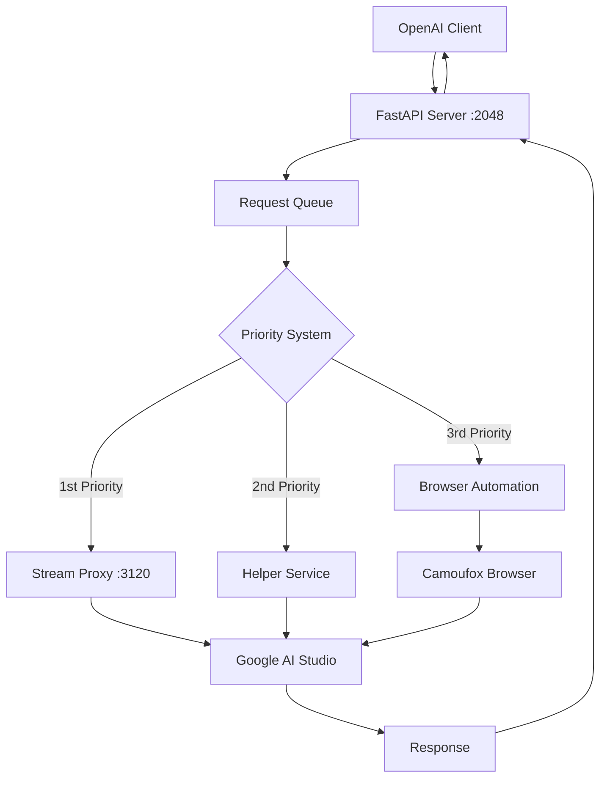

# AI Studio Proxy API

A high-performance proxy server that provides OpenAI-compatible API access to Google AI Studio using Python, FastAPI, Playwright, and Camoufox.

## Table of Contents

- [AI Studio Proxy API](#ai-studio-proxy-api)
  - [Table of Contents](#table-of-contents)
  - [🚀 Quick Start](#-quick-start)
  - [📋 Project Overview](#-project-overview)
  - [✨ Core Features](#-core-features)
  - [🏗️ Architecture](#️-architecture)
  - [📦 Installation](#-installation)
  - [🔧 Configuration](#-configuration)
  - [🌐 API Reference](#-api-reference)
  - [🛠️ Usage Examples](#️-usage-examples)
  - [🔍 Troubleshooting](#-troubleshooting)
  - [🖥️ Multi-Platform Support](#️-multi-platform-support)
  - [⚙️ Advanced Configuration](#️-advanced-configuration)
  - [📚 Additional Resources](#-additional-resources)

## 🚀 Quick Start

Get up and running in minutes:

```bash
# Clone and setup
git clone https://github.com/lolsZz/AIstudioProxyAPI
cd AIstudioProxyAPI

# Create virtual environment
uv venv .venv
source .venv/bin/activate  # Linux/macOS
# .venv\Scripts\activate  # Windows

# Install dependencies
uv install -r requirements.txt
uv install camoufox[geoip]

# Download browser
camoufox fetch

# Start the server
./start.sh
```

**That's it!** Your OpenAI-compatible API is now running at `http://127.0.0.1:2048/v1`

## 📋 Project Overview

AI Studio Proxy API is a high-performance proxy server that provides OpenAI-compatible API access to Google AI Studio. It enables any OpenAI-compatible client (Open WebUI, LobeChat, NextChat, etc.) to seamlessly use Google's Gemini models.

**Key Technologies:**

- **FastAPI**: High-performance API server with OpenAI-compatible endpoints
- **Playwright + Camoufox**: Advanced browser automation with anti-detection capabilities
- **Modular Architecture**: Clean separation of concerns for maintainability
- **Request Queue**: Ensures stable, sequential processing
- **Streaming Support**: Real-time response streaming

## ✨ Core Features

- **🔌 OpenAI API Compatibility**: Drop-in replacement for OpenAI API
  - `/v1/chat/completions` - Chat completions with streaming support
  - `/v1/models` - List available Gemini models
  - `/health` - Health check endpoint
  - `/api/info` - API information and status

- **🤖 15+ Gemini Models**: Access to the latest Google AI models
  - Gemini 2.5 Pro Preview, Flash Preview
  - Gemini 2.0 Flash, Flash-Lite
  - Gemini 1.5 Pro, Flash, Flash-8B
  - Gemma 3 models (1B, 4B, 12B, 27B)
  - LearnLM 2.0 Flash Experimental

- **⚡ High Performance**: Multiple response methods for optimal speed
  - Integrated streaming proxy (port 3120) - Primary method
  - External helper service support - Secondary method
  - Browser automation fallback - Tertiary method

- **🔐 Smart Authentication**: Automated login management
  - One-time setup with persistent authentication
  - Automatic authentication file management
  - Debug mode for initial setup

- **🚀 Easy Deployment**: Multiple launch options
  - Auto mode - Intelligent mode selection
  - Headless mode - Production deployment
  - Debug mode - Development and setup
  - GUI launcher - User-friendly interface

- **🛡️ Anti-Detection**: Advanced stealth capabilities
  - Camoufox browser with fingerprint spoofing
  - Real user traffic simulation
  - Enhanced success rates

## 🏗️ Architecture

The system uses a three-tier approach for maximum reliability:



**Request Processing Priority:**
1. **Stream Proxy** (Port 3120) - Direct HTTPS interception for maximum speed
2. **Helper Service** (Optional) - External service integration
3. **Browser Automation** - Camoufox fallback for complex interactions

## Project Structure

**🎉 Restructured for Modern Python Development**

```text
aistudio_proxy_api/
├── 📁 aistudio_proxy/                 # Main package (NEW)
│   ├── __init__.py                    # Package initialization
│   ├── main.py                        # Main application entry
│   ├── server.py                      # FastAPI server
│   │
│   ├── 📁 api/                        # API layer (RENAMED from api_utils)
│   │   ├── __init__.py
│   │   ├── app.py                     # FastAPI application
│   │   ├── routes.py                  # API routes
│   │   ├── request_processor.py       # Request processing
│   │   ├── queue_worker.py            # Queue worker
│   │   └── utils.py                   # API utilities
│   │
│   ├── 📁 browser/                    # Browser automation (RENAMED from browser_utils)
│   │   ├── __init__.py
│   │   ├── initialization.py          # Browser initialization
│   │   ├── operations.py              # Page operations
│   │   └── model_management.py        # Model management
│   │
│   ├── 📁 stream/                     # Stream proxy (MOVED)
│   │   ├── __init__.py
│   │   ├── main.py                    # Stream service entry
│   │   ├── proxy_server.py            # Proxy server
│   │   ├── proxy_connector.py         # Proxy connector
│   │   ├── interceptors.py            # Request interceptors
│   │   ├── cert_manager.py            # Certificate management
│   │   └── utils.py                   # Stream utilities
│   │
│   ├── 📁 core/                       # Core business logic (NEW)
│   │   ├── __init__.py
│   │   ├── chat.py                    # Chat data models
│   │   ├── exceptions.py              # Custom exceptions
│   │   └── logging.py                 # Logging models
│   │
│   ├── 📁 config/                     # Configuration management (MOVED)
│   │   ├── __init__.py
│   │   ├── settings.py                # Main settings
│   │   ├── constants.py               # Constants
│   │   ├── selectors.py               # CSS selectors
│   │   └── timeouts.py                # Timeout configuration
│   │
│   └── 📁 utils/                      # Utilities (NEW)
│       ├── __init__.py
│       └── setup.py                   # Logging utilities (MOVED from logging_utils)
│
├── 📁 scripts/                        # Entry points and utilities (NEW)
│   ├── start.sh                       # Main startup script
│   ├── start.py                       # Python startup script
│   ├── test_api.sh                    # API testing script
│   ├── launch_camoufox.py             # Browser launcher
│   ├── gui_launcher.py                # GUI launcher
│   ├── fetch_camoufox_data.py         # Camoufox data fetcher
│   └── llm.py                         # Local LLM simulation
│
├── 📁 static/                         # Static assets (NEW)
│   ├── 📁 web/                        # Web UI files
│   │   ├── index.html                 # Web interface
│   │   ├── webui.css                  # Web UI styles
│   │   └── webui.js                   # Web UI scripts
│   └── 📁 certs/                      # SSL certificates (MOVED)
│
├── 📁 data/                           # Data and profiles (NEW)
│   ├── 📁 auth_profiles/              # Authentication profiles (MOVED)
│   │   ├── active/                    # Current auth files
│   │   └── saved/                     # Saved auth files
│   └── 📁 logs/                       # Log files (MOVED)
│
├── 📁 tests/                          # Test suite (NEW)
├── 📁 docs/                           # Additional documentation (NEW)
│
├── pyproject.toml                     # Modern Python packaging (NEW)
├── requirements.txt                   # Dependencies
├── README.md                          # Main documentation
├── server.py                          # Main server entry (UPDATED)
└── (compatibility layers)             # Backward compatibility files
```

**✅ Backward Compatibility**: All original imports and scripts continue to work unchanged!

### Module Responsibilities

**New Package Structure:**
- **aistudio_proxy.api/**: FastAPI application, routes, request processing, and queue management
- **aistudio_proxy.browser/**: Browser automation, initialization, and model management
- **aistudio_proxy.stream/**: High-performance streaming proxy with certificate management
- **aistudio_proxy.core/**: Core business logic, data models, and exceptions
- **aistudio_proxy.config/**: Configuration management (environment variables, constants, selectors, timeouts)
- **aistudio_proxy.utils/**: Shared utilities and logging configuration
- **scripts/**: Entry points and utility scripts
- **static/**: Web UI assets and SSL certificates
- **data/**: Runtime data, authentication profiles, and logs

**Backward Compatibility**: Original module names (`api_utils`, `browser_utils`, etc.) still work through compatibility layers.

## Disclaimer

Do not use this project, it is for educational purposes only.

## Core Features

- **OpenAI API Compatibility**: Provides endpoints: `/v1/chat/completions`, `/v1/models`, `/api/info`, `/health`, `/v1/queue`, `/v1/cancel/{req_id}` (default port `2048`)
- **Dynamic Model Switching**: Uses the `model` field in API requests to switch models on AI Studio
- **Streaming Support**: Supports both `stream=true` and `stream=false` modes
- **Multiple Response Methods**:
  1. **Integrated streaming proxy service** (port `3120`, default)
  2. **External Helper Service** (optional)
  3. **Playwright Page Interaction** (fallback)
- **Request Queue**: Sequential processing using `asyncio.Queue` for improved stability
- **Camoufox Integration**: Anti-fingerprinting and anti-detection capabilities
- **Multiple Startup Modes**:
  - **Debug mode** (`--debug`): Browser UI for authentication and debugging
  - **Headless mode** (`--headless`): Background operation with saved authentication
  - **Virtual display** (`--virtual-display`): Linux-only headless with Xvfb
- **Web UI**: Modern chat interface at the `/` endpoint
- **Modular Architecture**: Clear separation of responsibilities
- **GUI Launcher**: Tkinter interface for easy service management
- **Error Handling**: Automatic screenshots and HTML saves in `errors_py/`
- **Configurable Logging**: Environment variable control

## Important notes (Python version)

- **Unofficial project**: Depends on the AI Studio web interface, which may become invalid due to page updates.
- **Authentication files are critical**: Headless mode heavily relies on valid `.json` authentication files in `auth_profiles/active/`. Files may expire and need to be replaced.
- **CSS selector dependency**: Page interactions depend on the CSS selectors defined in [`config/selectors.py`](config/selectors.py). AI Studio page updates may cause these selectors to become invalid.
- **Stability**: Browser automation is inherently less stable than native APIs and may need to be restarted after running for a long time.
- **AI Studio limitations**: Cannot bypass AI Studio's own rate, content, and other restrictions.
- **Port numbers**: The default port for FastAPI service is `2048`. The default port for the integrated streaming proxy service is `3120`.

## Project workflow diagram

```mermaid
graph TD
    subgraph "User Side"
        User["User"]
    end

    subgraph "Launch Methods"
        CLI_Launch["launch_camoufox.py (CLI)"]
        GUI_Launch["gui_launcher.py (GUI)"]
    end

    subgraph "Core Services"
        ServerPY["server.py (FastAPI + Playwright)"]
        StreamProxy["stream.py (Integrated Stream Proxy)"]
        CamoufoxInstance["Camoufox Browser Instance"]
    end

    subgraph "External Dependencies & Services"
        AI_Studio["Target AI Service (e.g., Google AI Studio)"]
        OptionalHelper["(Optional) External Helper Service"]
    end

    subgraph "API Clients"
        API_Client["API Client (e.g., Open WebUI, cURL)"]
    end

    User -- "Executes command" --> CLI_Launch
    User -- "Interacts with UI" --> GUI_Launch

    GUI_Launch -- "Builds & executes command" --> CLI_Launch

    CLI_Launch -- "Starts & manages" --> ServerPY
    CLI_Launch -- "If --stream-port > 0" --> StreamProxy
    CLI_Launch -- "Via --helper <url>" --> ServerPY

    ServerPY -- "Controls browser" --> CamoufoxIpip install -U camoufox[geoip]-U camoufox[geoip]nstance
    ServerPY -- "Request (Priority 1)" --> StreamProxy
    StreamProxy -- "Direct request" --> AI_Studio
    StreamProxy -- "Response" --> ServerPY

    ServerPY -- "Request (Priority 2, if StreamProxy disabled AND Helper configured)" --> OptionalHelper
    OptionalHelper -- "Response" --> ServerPY

    ServerPY -- "Request (Priority 3, if StreamProxy AND Helper disabled/failed)" --> CamoufoxInstance
    CamoufoxInstance -- "Interacts with AI Service" --> AI_Studio

    API_Client -- "API Request /v1/chat/completions" --> ServerPY
    ServerPY -- "API Response" --> API_Client
```

## 📦 Installation

### Prerequisites

- **Python 3.8+** (3.9+ recommended)
- **uv** package manager (recommended) or pip
- **Git** (for cloning)
- **Google AI Studio account** with access
- **xvfb** (Linux only, for `--virtual-display` mode)

### Quick Install

```bash
# Clone repository
git clone https://github.com/lolsZz/AIstudioProxyAPI
cd AIstudioProxyAPI

# Create virtual environment
uv venv .venv
source .venv/bin/activate  # Linux/macOS
# .venv\Scripts\activate    # Windows

# Install dependencies
uv install -r requirements.txt
uv install camoufox[geoip]

# Download browser
camoufox fetch

# Start server
./start.sh
```

### Alternative: pip Installation

```bash
# If you prefer pip over uv
python -m venv .venv
source .venv/bin/activate

pip install -r requirements.txt
pip install -U camoufox[geoip]
camoufox fetch

./start.sh
```

## 🔧 Configuration

### Initial Authentication Setup

First-time users need to authenticate with Google AI Studio:

```bash
# Run authentication setup
./start.sh auth

# Or use debug mode
./start.sh debug
```

1. **Complete Google login** in the browser window
2. **Navigate to AI Studio** chat interface
3. **Authentication files** are automatically saved to `auth_profiles/active/`

### Launch Modes

```bash
# Auto mode (recommended) - smart mode selection
./start.sh

# Headless mode - production deployment
./start.sh headless

# Debug mode - development and troubleshooting
./start.sh debug

# Authentication setup only
./start.sh auth

# Test API endpoints
./start.sh test
```

### Port Configuration

```bash
# Custom ports
./start.sh headless --server-port 8080 --stream-port 3121

# Environment variables
export SERVER_PORT=8080
export STREAM_PORT=3121
./start.sh
```

## 🌐 API Reference

### Base URLs

- **API Base**: `http://127.0.0.1:2048/v1`
- **Health Check**: `http://127.0.0.1:2048/health`
- **Web UI**: `http://127.0.0.1:2048/`

### Endpoints

| Endpoint | Method | Description |
|----------|--------|-------------|
| `/v1/chat/completions` | POST | OpenAI-compatible chat completions |
| `/v1/models` | GET | List available Gemini models |
| `/health` | GET | Health check and status |
| `/api/info` | GET | API information and statistics |
| `/v1/queue` | GET | Request queue status |

### Chat Completions

```bash
curl -X POST http://127.0.0.1:2048/v1/chat/completions \
  -H 'Content-Type: application/json' \
  -d '{
    "model": "gemini-2.5-pro-preview-06-05",
    "messages": [
      {"role": "system", "content": "You are a helpful assistant."},
      {"role": "user", "content": "Explain quantum computing"}
    ],
    "stream": false,
    "temperature": 0.7,
    "max_output_tokens": 500,
    "top_p": 0.9
  }'
```

### Available Models

```bash
curl http://127.0.0.1:2048/v1/models
```

**Response includes:**
- Gemini 2.5 Pro Preview, Flash Preview
- Gemini 2.0 Flash, Flash-Lite
- Gemini 1.5 Pro, Flash, Flash-8B
- Gemma 3 models (1B, 4B, 12B, 27B)
- LearnLM 2.0 Flash Experimental

## 🛠️ Usage Examples

### Python with OpenAI Library

```python
import openai

client = openai.OpenAI(
    base_url="http://127.0.0.1:2048/v1",
    api_key="not-needed"  # No API key required
)

response = client.chat.completions.create(
    model="gemini-2.5-pro-preview-06-05",
    messages=[{"role": "user", "content": "Hello!"}]
)
print(response.choices[0].message.content)
```

### Streaming Example

```python
stream = client.chat.completions.create(
    model="gemini-2.5-flash-preview-06-05",
    messages=[{"role": "user", "content": "Write a story"}],
    stream=True
)

for chunk in stream:
    if chunk.choices[0].delta.content:
        print(chunk.choices[0].delta.content, end="")
```

### Client Configuration

**Open WebUI Setup:**
1. Go to Settings → Connections
2. Add new connection:
   - **API Base URL**: `http://127.0.0.1:2048/v1`
   - **API Key**: `not-needed` (or leave blank)
3. Save and test connection

**Other Compatible Clients:**

- LobeChat, NextChat, ChatGPT-Next-Web
- Any OpenAI-compatible application

## 🔍 Troubleshooting

### Quick Diagnostics

```bash
# Check server status
curl http://127.0.0.1:2048/health

# Test API endpoints
./start.sh test

# View logs
tail -f logs/app.log
```

### Common Issues

#### Installation Problems

**Camoufox installation fails:**
```bash
# Try without geoip data
uv install camoufox

# Or use the fallback script
python fetch_camoufox_data.py
```

**Virtual environment issues:**
```bash
# Recreate environment
rm -rf .venv
uv venv .venv
source .venv/bin/activate
uv install -r requirements.txt
```

#### Authentication Issues

**Authentication expired:**
```bash
# Remove old auth and re-authenticate
rm auth_profiles/active/*.json
./start.sh auth
```

**Browser won't start:**
```bash
# Check dependencies (Linux)
sudo apt-get install xvfb

# Try debug mode
./start.sh debug
```

#### Server Issues

**Port already in use:**
```bash
# Use different port
./start.sh headless --server-port 8080

# Or kill existing process
lsof -ti:2048 | xargs kill -9
```

**API not responding:**
```bash
# Check if server is running
ps aux | grep python

# Restart server
./start.sh headless
```

### Performance Issues

**Slow responses:**
- Ensure stream proxy is enabled (port 3120)
- Check network connectivity to Google services
- Try different Gemini models (Flash models are faster)

**Memory usage:**

- Restart server periodically for long-running deployments
- Use headless mode for production
- Monitor logs for memory leaks

## 🖥️ Multi-Platform Support

### Linux (Recommended)

**Ubuntu/Debian:**
```bash
# Install system dependencies
sudo apt-get update
sudo apt-get install python3 python3-pip python3-venv xvfb

# Install uv (recommended)
curl -LsSf https://astral.sh/uv/install.sh | sh
```

**CentOS/RHEL:**
```bash
sudo yum install python3 python3-pip xorg-x11-server-Xvfb
```

### macOS

**Using Homebrew:**
```bash
# Install Python and uv
brew install python uv

# Follow standard installation
```

### Windows

**Native Windows:**
```bash
# Install Python from python.org
# Ensure "Add Python to PATH" is checked

# Install uv
powershell -c "irm https://astral.sh/uv/install.ps1 | iex"

# Use PowerShell for commands
.venv\Scripts\activate
```

**WSL2 (Recommended for Windows):**
```bash
# Install WSL2 with Ubuntu
wsl --install

# Follow Linux instructions inside WSL
```

## ⚙️ Advanced Configuration

### Environment Variables

```bash
# Server configuration
export SERVER_PORT=2048
export STREAM_PORT=3120
export SERVER_LOG_LEVEL=INFO

# Authentication
export AUTO_SAVE_AUTH=true

# Proxy settings
export INTERNAL_CAMOUFOX_PROXY="http://proxy:8080"

# Debug settings
export DEBUG_LOGS_ENABLED=true
export TRACE_LOGS_ENABLED=false
```

### Streaming Proxy Configuration

The integrated streaming proxy provides the fastest response times:

**Features:**
- Direct HTTPS interception on port 3120
- Dynamic SSL certificate generation
- OpenAI-compatible response formatting
- Automatic Google domain handling

**Certificate Management:**
```bash
# Regenerate certificates if needed
openssl genrsa -out certs/ca.key 2048
openssl req -new -x509 -days 3650 -key certs/ca.key -out certs/ca.crt \
  -subj '/C=US/ST=CA/L=SF/O=AIStudioProxy/CN=AIStudioProxy CA'
```

### Production Deployment

**Systemd Service (Linux):**
```ini
[Unit]
Description=AI Studio Proxy API
After=network.target

[Service]
Type=simple
User=aistudio
WorkingDirectory=/opt/aistudio-proxy
ExecStart=/opt/aistudio-proxy/start.sh headless
Restart=always
RestartSec=10

[Install]
WantedBy=multi-user.target
```

**Docker Alternative (if needed):**
```bash
# While Docker support was removed, you can create a simple container
FROM python:3.11-slim
WORKDIR /app
COPY . .
RUN pip install -r requirements.txt && pip install camoufox[geoip]
RUN camoufox fetch
CMD ["./start.sh", "headless"]
```

## 📚 Additional Resources

### About Camoufox

[Camoufox](https://camoufox.com/) provides enhanced anti-fingerprinting capabilities:

- **Stealth Technology**: C++-level browser modifications (not JavaScript injection)
- **Fingerprint Spoofing**: Mimics real user traffic patterns
- **Playwright Compatible**: Drop-in replacement for standard browsers

### Logging and Monitoring

**Log Levels:**
- `DEBUG` - Detailed debugging information
- `INFO` - General operational messages
- `WARNING` - Warning messages
- `ERROR` - Error conditions

**Log Files:**
- `logs/app.log` - Main application logs
- `logs/launch_app.log` - Launcher logs
- Web UI - Real-time log streaming

### Performance Optimization

**Best Practices:**
- Use headless mode for production
- Enable stream proxy (port 3120) for fastest responses
- Choose appropriate Gemini models (Flash for speed, Pro for quality)
- Monitor memory usage and restart periodically
- Use virtual display on Linux servers

---

**⚠️ Disclaimer**: This is an unofficial project for educational purposes. It depends on Google AI Studio's web interface and may become invalid due to page updates.
